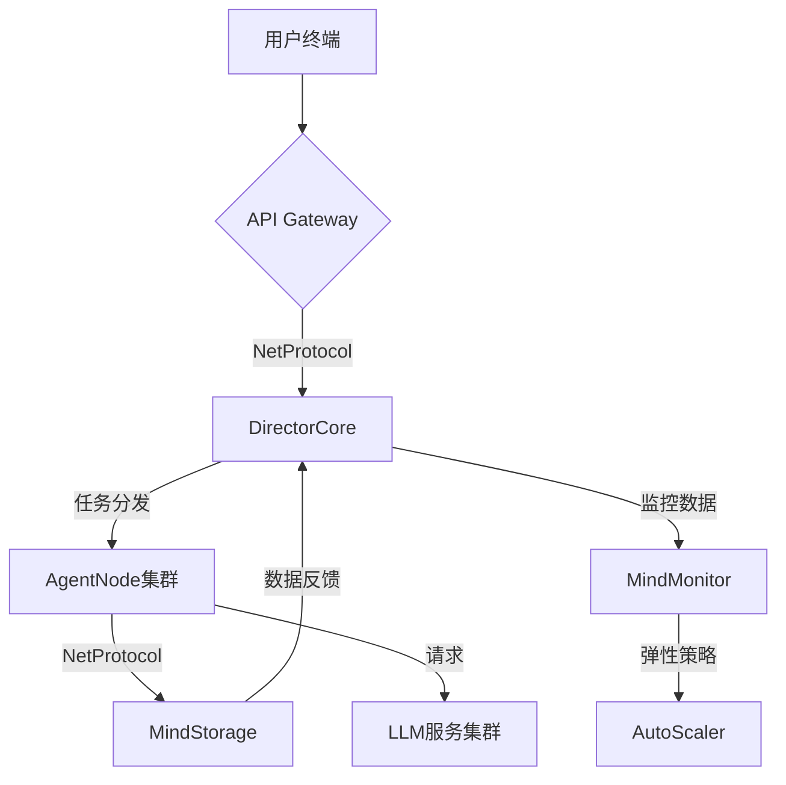

# MindHub - 智能决策协作中枢框架 🧠🤖

[](https://opensource.org/licenses/MIT)
[](https://www.python.org/)
[](https://semver.org)
[](https://example.com/build) <!-- 替换为实际的构建状态 -->

[English](./README_EN.md) | 简体中文

---

## 🌟 项目简介

MindHub 是一个基于大型语言模型（LLM）的智能体（Agent）协作平台，旨在实现**人类级决策与机器执行的完美融合**。它允许用户通过自然语言提问，MindHub 将问题分解为一系列子任务，并由不同的 Agent 协同完成，最终返回综合结果。MindHub 采用**层级化智能架构**，模仿企业中决策层与执行层的协作模式，实现复杂任务的自动化处理。

## ✨ 核心特性

*   **思维链可观测性：** 通过 MindMonitor 组件（可选），可以实时查看任务的执行过程和变量的变化，了解 Agent 的“思考”过程。
*   **弹性思维深度：** 通过优先级引擎和上下文压缩算法，MindHub 可以动态调整任务的执行顺序和深度，优化资源利用率。
*   **分布式思维网络：** AgentNode 可以跨物理节点组成思维网络，通过 NetProtocol 实现跨机房通信，支持大规模任务处理。
*   **动态记忆中枢：** 采用全局状态感知与上下文压缩技术，实现长期记忆的摘要存储。
*   **模块化设计：** 代码结构清晰，模块之间职责分离，易于维护和扩展。
*   **安全通信协议：** 基于 NetProtocol 的加密指令传输（可选 MindCipher 组件），保障系统安全。
*   **自进化工作流:** 通过执行反馈优化决策策略 (未来计划).
*   **多模态适配器:** 支持文本/图像/结构化数据交互 (未来计划).

---

## 🏗 系统架构



*   **用户终端 (User Terminal):** 用户与系统交互的入口（Web 界面、移动应用、命令行工具等）。
*   **API Gateway:** 接收用户请求，进行初步验证、路由和协议转换。
*   **DirectorCore:** 任务调度中枢，负责任务管理、调度、优先级计算、上下文压缩和协调。
*   **AgentNode 集群:** 执行具体任务的角色节点，包含不同类型的 Agent（ExpertAgent、CriticAgent、ExecutorAgent）。
*   **MindStorage:** 存储系统中的变量、中间结果和任务状态，支持版本控制和快照（时光机功能）。
*   **LLM 服务集群:** 提供 LLM 的推理能力，支持多种 LLM 模型。
*   **MindMonitor (可选):** 监控系统运行状态，提供思维链追踪可视化和性能指标。
*   **AutoScaler:** 根据监控数据自动调整 AgentNode 集群的资源。

---

## 🧩 核心组件

*   **DirectorCore:**
    *   `director_core.py`: 任务调度核心逻辑。
    *   `task_graph.py`: 任务图管理（TaskOrchestrator）。
    *   `priority_engine.py`: 优先级计算引擎。
    *   `context_compressor.py`: 上下文压缩器。
*   **AgentNode:**
    *   `agent_node.py`: AgentNode 基类。
    *   `expert_agent.py`: 专业 Agent。
    *   `critic_agent.py`: 评论 Agent（可选）。
    *   `executor_agent.py`: 执行 Agent（可选）。
    *   `thought_template.py`: 思维模板。
    *   `neuro_parser.py`: 神经解析器。
*   **NetProtocol:**
    *   `message_broker.py`: 消息代理（MindMessageBroker）。
    *   `serializer.py`: 序列化器基类。
    *   `avro_serializer.py`: Avro 序列化器。
    *   `schema_registry.py`: Schema 注册表。
*   **MindStorage:**
    *   `mind_storage.py`: 存储接口。
    *   `redis_storage.py`: Redis 实现。
    *   `interface.py`: 存储接口定义。
    *   `models.py`: 数据模型定义。
*   **MindCipher (可选):**
    *   `mind_cipher.py`: 加密/解密。
    *   `aes_gcm_cipher.py`: AES-GCM 实现。
*   **LLMGateway (可选):**
    *   `llm_gateway.py`: LLM 网关基类。
    *   `openai_gateway.py`: OpenAI 实现（可选）。
    *   `huggingface_gateway.py`: Hugging Face 实现（可选）。
*   **MindMonitor (可选):**
    *   `mind_monitor.py`: 监控核心。
    *   `metrics.py`: 指标定义。
    *   `visualizer.py`: 可视化工具。

## 🚀 快速开始

1.  **克隆仓库:**

    ```bash
    git clone https://github.com/your-org/MindHub.git  # 替换为你的仓库地址
    cd MindHub
    ```

2.  **安装依赖:**

    ```bash
    pip install -r requirements.txt
    ```

3.  **配置:**

    *   根据需要修改 `configs/` 目录下的配置文件。
    *   如果使用 MindCipher，设置 `NET_SECRET` 环境变量（或在配置文件中设置）。

4.  **运行:**
    *   启动 MindStorage（例如 Redis）:

    ```bash
    redis-server /path/to/redis.conf  # 如果使用 Redis
    ```

    *   启动 DirectorCore:

    ```bash
    python mindhub/architecture/director/director_core.py
    ```

    *   启动 AgentNode:

    ```bash
    python mindhub/architecture/agent/agent_node.py
    ```

## 📚 开发文档

更详细的开发文档，包括各个模块的 API 参考、配置说明、部署指南等，请参阅 `docs/` 目录下的文档。

| 模块          | 文档地址                     |
| ------------- | ---------------------------- |
| 架构设计      | `docs/architecture.md`       |
| 用户指南      | `docs/user_guide.md`        |
| API 参考      | `docs/api_reference.md` (可选) |
| DirectorCore  | (待补充)                     |
| AgentNode     | (待补充)                     |
| NetProtocol   | (待补充)                     |
| MindStorage   | (待补充)                     |
| MindCipher    | (待补充)                     |
| LLMGateway    | (待补充)                     |
| MindMonitor   | (待补充)                     |

## 🤝 贡献指南

我们欢迎各种形式的贡献！请遵循以下流程：

1.  提交 Issue 描述建议或 Bug。
2.  Fork 仓库并创建特性分支。
3.  提交 Pull Request 并关联 Issue。
4.  通过 CI 测试和代码审查。

**代码规范要求：**

*   遵循 PEP 8 标准。
*   重要函数需包含类型标注。
*   新增功能必须附带单元测试。

## 📜 许可证

本项目采用 [MIT License](LICENSE)。

---