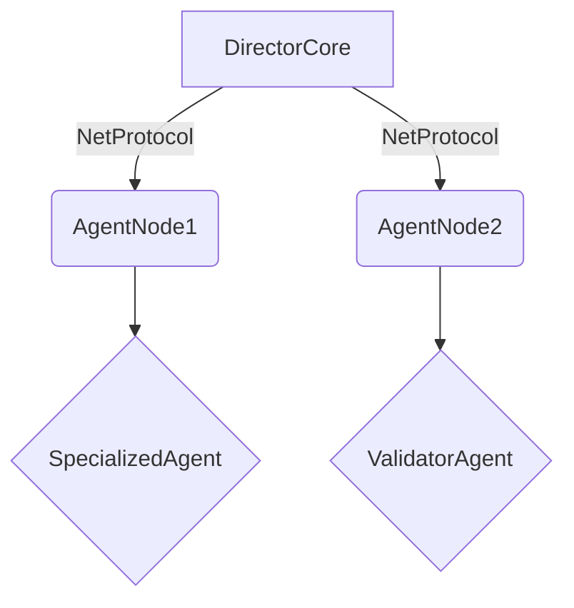

# MindHub - 智能决策协作中枢框架 🧠🤖

[](https://opensource.org/licenses/MIT)
[](https://www.python.org/)
[](https://semver.org)

**人类级决策与机器执行的完美融合系统**

[English](./README_EN.md) | 简体中文

---

## 🌟 核心特性

- **层级化智能架构** - 仿生企业决策层与执行层的协作模式
- **动态记忆中枢** - 全局状态感知与上下文压缩技术
- **安全通信协议** - 基于NetProtocol的加密指令传输
- **自进化工作流** - 通过执行反馈优化决策策略
- **多模态适配器** - 支持文本/图像/结构化数据交互

---

## 🏗 系统架构



---

## 🧩 核心子系统

### 1. DirectorCore (决策中枢)
- **智能路由引擎** - 基于上下文的任务分配
- **记忆压缩模块** - 实现长期记忆的摘要存储
- **策略优化器** - 动态调整协作规则

### 2. AgentNode (执行节点)
- **技能插件系统** - 支持即插即用能力扩展
- **安全沙箱** - 隔离执行环境
- **效能分析器** - 实时监控资源消耗

### 3. NetProtocol (协作协议)
- **指令加密** - AES-256通信加密
- **心跳检测** - 节点健康状态监控
- **优先级通道** - 关键任务优先处理

---

## 🚀 快速开始

### 安装要求
```bash
git clone https://github.com/your-org/MindHub.git
cd MindHub
pip install -r requirements.txt
```
<!-- 
### 基础配置
```bash
# 设置环境变量
export MINDHUB_KEY="your_encryption_key"
export DIRECTOR_PORT=8080
```

### 启动决策中枢
```python
from director_core import Director

director = Director(
    memory_size="5GB", 
    log_level="debug"
)
director.initialize_network()
```

### 部署执行节点
```yaml
# config/agent_node.yml
nodes:
  - type: analysis_agent
    skills: [nlp, data_processing]
    resource_limit: 2CPU-4GB
  - type: validation_agent
    skills: [fact_check, error_detect]
```

---

## 📚 开发文档

| 模块 | 文档地址 | 示例 |
|-------|---------|------|
| DirectorCore | [docs/director.md](docs/director.md) | [决策流示例](examples/director_flow.py) |
| AgentNode | [docs/agent.md](docs/agent.md) | [插件开发示例](examples/custom_plugin.py) |
| NetProtocol | [docs/protocol.md](docs/protocol.md) | [通信加密示例](examples/secure_channel.py) | -->

---

## 🤝 贡献指南

我们欢迎各种形式的贡献！请遵循以下流程：
1. 提交Issue描述建议
2. Fork仓库并创建特性分支
3. 提交Pull Request并关联Issue
4. 通过CI测试和代码审查

**代码规范要求**：
- 遵循PEP8标准
- 重要函数需包含类型标注
- 新增功能必须附带单元测试

---

## 📜 许可证

本项目采用 [MIT License](LICENSE)

---

<!-- ## 🌐 致谢

- 采用部分OpenAI的技术规范
- 感谢TensorFlow社区的底层支持 -->
